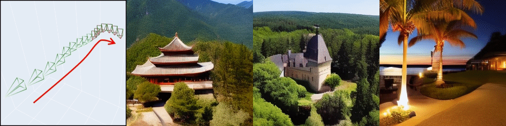
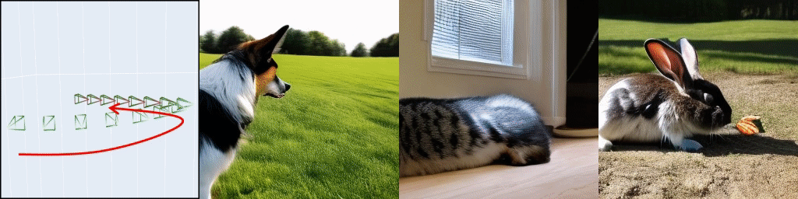
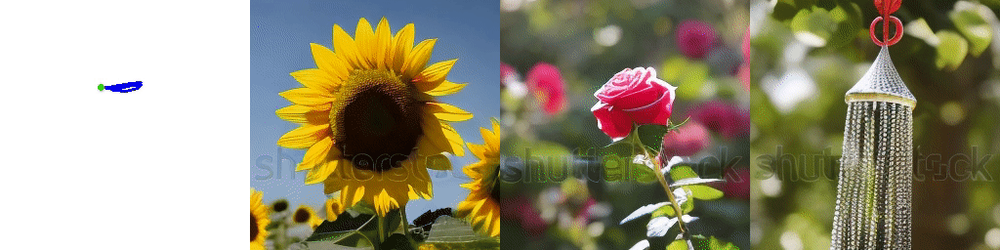
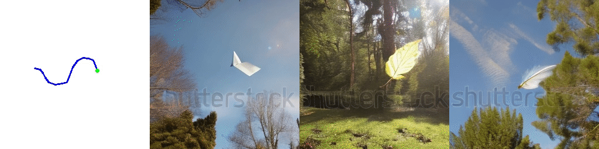

<p align="center">
  
</p>
<div align="center">

## MotionCtrl: A Unified and Flexible Motion Controller for Video Generation

#### [SIGGRAPH 2024 CONFERENCE PROCEEDINGS]

### <div align="center">👉 MotionCtrl for <b><a href="https://github.com/TencentARC/MotionCtrl/tree/svd">[SVD]</a>, for <a href="https://github.com/TencentARC/MotionCtrl/tree/main">[VideoCrafter]</a>, for <a href="https://github.com/TencentARC/MotionCtrl/tree/animatediff">[AnimateDiff]</a></b></div>

[](https://wzhouxiff.github.io/projects/MotionCtrl/assets/paper/MotionCtrl.pdf) &ensp; [](https://arxiv.org/pdf/2312.03641.pdf) &ensp; [](https://wzhouxiff.github.io/projects/MotionCtrl/)

🤗 [](https://huggingface.co/spaces/TencentARC/MotionCtrl_SVD) &ensp; 🤗 [](https://huggingface.co/spaces/TencentARC/MotionCtrl)

</div>

---

## 🔥🔥 We have released both **Training** and **Inference** code of MotionCtrl deployed on [Animatediff](https://github.com/TencentARC/MotionCtrl/tree/animatediff)

🔥🔥 We release the codes, [models](https://huggingface.co/TencentARC/MotionCtrl/tree/main) and [demos](https://huggingface.co/spaces/TencentARC/MotionCtrl_SVD) for MotionCtrl on [Stable Video Diffusion (SVD)](https://github.com/Stability-AI/generative-models).

---

https://github.com/TencentARC/MotionCtrl/assets/19488619/45d44bf5-d4bf-4e45-8628-2c8926b5954a

---


Official implementation of [MotionCtrl: A Unified and Flexible Motion Controller for Video Generation](https://arxiv.org/abs/2312.03641).

MotionCtrl can Independently control **complex camera motion** and **object motion** of generated videos, with **only a unified** model.

### Results of MotionCtrl+AnimateDiff

<div align="center">
    
    
    
    
</div>

### Results of MotionCtrl+SVD

More results are in [showcase_svd](https://github.com/TencentARC/MotionCtrl/blob/svd/doc/showcase_svd.md) and our [Project Page](https://wzhouxiff.github.io/projects/MotionCtrl/).

<div align="center">
    
    
    
    
</div>


### Results of MotionCtrl+VideoCrafter

More results are in our [Project Page](https://wzhouxiff.github.io/projects/MotionCtrl/).

<div align="center">
    
    
    
    
</div>

---

## 📝 Changelog

- [x] 20231225: Release MotionCtrl deployed on ***LVDM/VideoCrafter***.
- [x] 20231225: Gradio demo available. 🤗 [](https://huggingface.co/spaces/TencentARC/MotionCtrl)
- [x] 20231228: Provide local gradio demo for convenience.
- [x] 20240115 More camera poses used for testing are provided in `dataset/camera_poses`
- [x] 20240115 Release MotionCtrl deployed on ***SVD***. Codes are in the branch [svd](https://github.com/TencentARC/MotionCtrl/tree/svd) and Gradio Demo is available in 🤗 [](https://huggingface.co/spaces/TencentARC/MotionCtrl_SVD).
- [x] ❗❗❗ Gradio demo of MotionCtrl deployed on ***VideoCrafter2*** is available in 🤗 [](https://huggingface.co/spaces/TencentARC/MotionCtrl). You can also run it locally by `python -m app --share`.
<!-- - [ ] ❗❗❗ ***Training Code*** will be released soon. -->
- [x] ❗❗❗ Release MotionCtrl deployed on ***AnimateDiff*** are available in branch [animatediff](https://github.com/TencentARC/MotionCtrl/tree/animatediff), containing both **training** and **inference** code.

---

## ⚙️ Environment
    conda create -n motionctrl python=3.10.6
    conda activate motionctrl
    pip install -r requirements.txt

## 💫 Inference

- #### Run local inference script

1. Download the weights of MotionCtrl [motionctrl.pth](https://huggingface.co/TencentARC/MotionCtrl/blob/main/motionctrl.pth) and put it to `./checkpoints`.
2. Go into `configs/inference/run.sh` and set `condtype` as 'camera_motion', 'object_motion', or 'both'.
- `condtype=camera_motion` means only control the **camera motion** in the generated video.
- `condtype=object_motion` means only control the **object motion** in the generated video.
- `condtype=both` means control the camera motion and object motion in the generated video **simultaneously**.
3. Running scripts:
        sh configs/inference/run.sh

- #### Run local gradio demo
      python -m app --share

## 🔥🔥 Training

<!-- ### 1. Preparing Pre-Trained Models
- [**VideoCrafter2**](https://huggingface.co/VideoCrafter/VideoCrafter2/blob/main/model.ckpt), put to `checkpoints/pretrained_models/` -->

### 1. Preparing Dataset
  - [RealEstate10K](https://google.github.io/realestate10k/)

    1.  Following https://github.com/cashiwamochi/RealEstate10K_Downloader to download and process the videos.
    2. Corresponding Captions and List are provided in [GoogleDrive](https://drive.google.com/drive/folders/1RYdBW3JUBYMUPdMHL2Yig6getEYN3Z3g?usp=drive_link).

## :books: Citation
If you make use of our work, please cite our paper.
```bibtex
@inproceedings{wang2024motionctrl,
  title={Motionctrl: A unified and flexible motion controller for video generation},
  author={Wang, Zhouxia and Yuan, Ziyang and Wang, Xintao and Li, Yaowei and Chen, Tianshui and Xia, Menghan and Luo, Ping and Shan, Ying},
  booktitle={ACM SIGGRAPH 2024 Conference Papers},
  pages={1--11},
  year={2024}
}
```

## 🤗 Acknowledgment
The current version of **MotionCtrl** is built on [VideoCrafter](https://github.com/AILab-CVC/VideoCrafter). We appreciate the authors for sharing their awesome codebase.

## ❓ Contact
For any question, feel free to email `wzhoux@connect.hku.hk` or `zhouzi1212@gmail.com`.
