# Showcase of MotionCtrl+SVD

Here are some examples for MotionCtrl+SVD.

We provide detailed configuration of each example, which might be helpful for reproducing the motion control shown in the example.

## EX.1

Images source: [Midjourney](https://www.midjourney.com/), prompt: "the great wall sunset --v 6.0 --aspect 16:9"

<table><tr>
<td>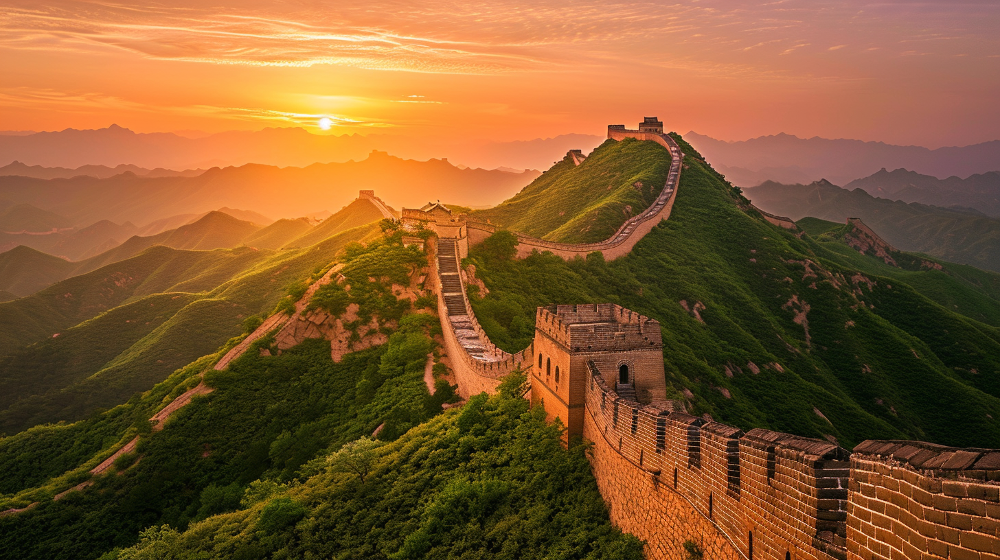</td>
<td>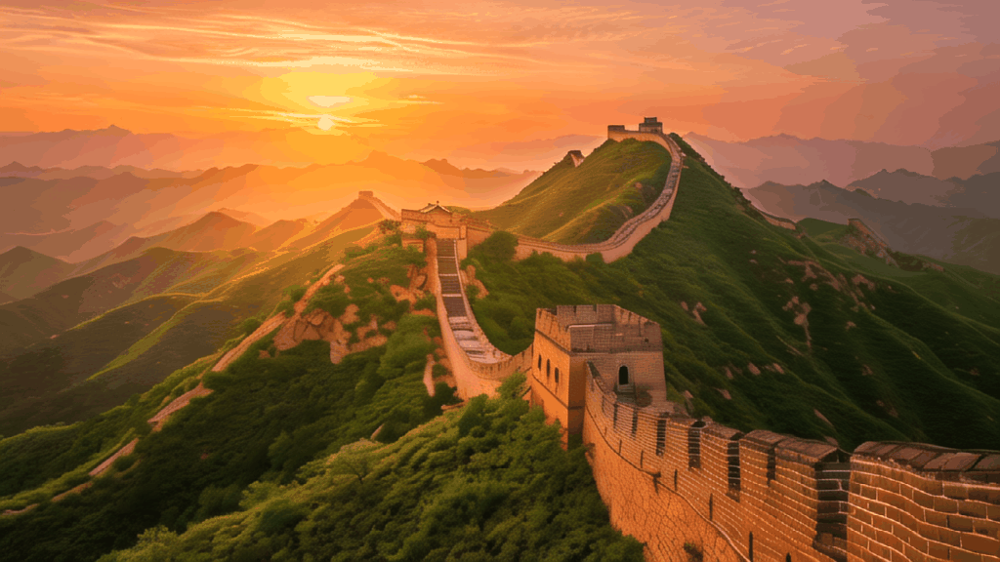</td>
</tr></table>

Settings:

- Image process: Center Crop To 576x1024
- MotionType: Provided Complex Camera Poses
- Camera: Pose_5
- speed : 1
- FPS: 6
- n_samples: 2
- Seed: 123

## EX.2

Images source: [Midjourney](https://www.midjourney.com/), prompt: "The Temple of Artemis and the Parthenon --v 6.0 --aspect 16:9"

<table><tr>
<td>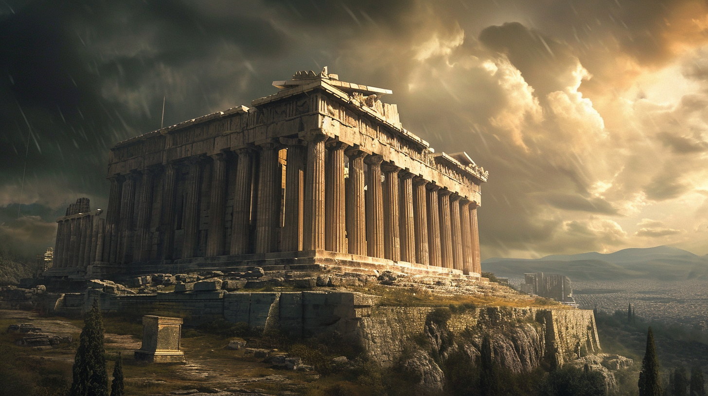</td>
<td></td>
</tr></table>

Settings:

- Image process: Center Crop To 576x1024
- MotionType: Provided Complex Camera Poses
- Camera: Pose_2
- speed : 3.
- FPS: 10
- n_samples: 2
- Seed: 1234

## EX.3

Images source: [Midjourney](https://www.midjourney.com/), prompt: "a cute cat --v 6.0 --aspect 16:9"

<table><tr>
<td></td>
<td>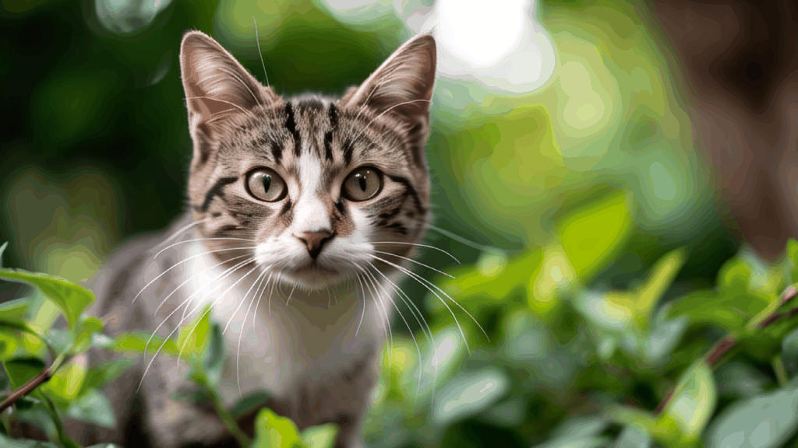</td>
</tr></table>

Settings:

- Image process: Center Crop To 576x1024
- MotionType: Basic Camera Poses
- Camera: Zoom Out
- speed : 3.
- FPS: 10
- n_samples: 2
- Seed: 1234

## EX.4

Images source: [Midjourney](https://www.midjourney.com/), prompt: "a cut dog corgi --v 6.0 --aspect 16:9"

<table><tr>
<td></td>
<td>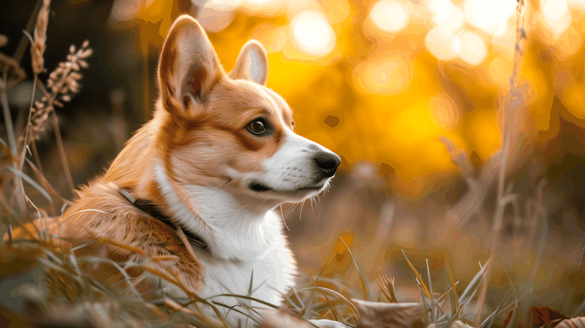</td>
</tr></table>

Settings:

- Image process: Center Crop To 576x1024
- MotionType: Custom Camera Poses -- Customized Mode 2: Both A and B
- Camera: [Pan Left, Zoom In]
- speed : 1.
- FPS: 6
- n_samples: 2
- Seed: 1234

## EX.5

Images source: [Midjourney](https://www.midjourney.com/), prompt: "the chinese feast--v 6.0 --aspect 16:9"

<table><tr>
<td>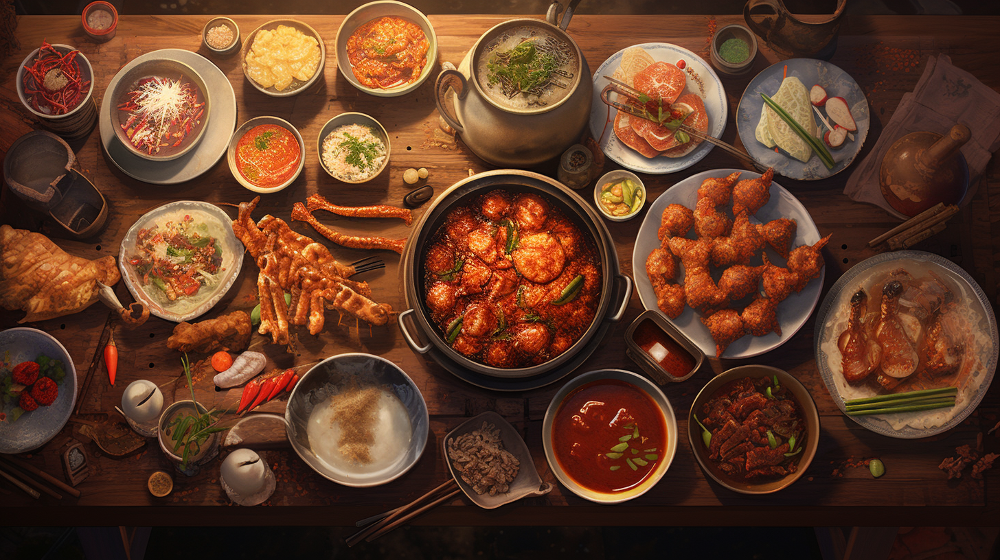</td>
<td></td>
</tr></table>

Settings:

- Image process: Center Crop To 576x1024
- MotionType: Basic Camera Poses
- Camera: Pan Right
- speed : 1.
- FPS: 10
- n_samples: 2
- Seed: 1234

## EX.6

Images source: [Midjourney](https://www.midjourney.com/), prompt: "Afternoon tea dessert--v 6.0 --aspect 16:9"

<table><tr>
<td></td>
<td>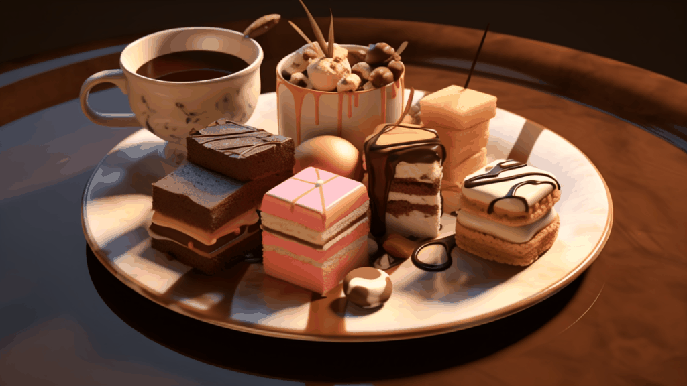</td>
</tr></table>

Settings:

- Image process: Center Crop To 576x1024
- MotionType: Basic Camera Poses
- Camera: Pan Left
- speed : 1.8
- FPS: 8
- n_samples: 2
- Seed: 123

## EX.7

Images source: [Link](https://image.baidu.com/search/detail?ct=503316480&z=3&ipn=d&word=%E8%BF%AA%E4%B8%BD%E7%83%AD%E5%B7%B4%E5%A3%81%E7%BA%B8&step_word=&hs=0&pn=20&spn=0&di=7264239678495129601&pi=0&rn=1&tn=baiduimagedetail&is=0%2C0&istype=2&ie=utf-8&oe=utf-8&in=&cl=2&lm=-1&st=-1&cs=3934446908%2C870997472&os=4215917212%2C2884701884&simid=3392066753%2C292439980&adpicid=0&lpn=0&ln=1790&fr=&fmq=1705213712052_R&fm=&ic=&s=undefined&hd=0&latest=0&copyright=0&se=&sme=&tab=0&width=0&height=0&face=undefined&ist=&jit=&cg=&bdtype=0&oriquery=&objurl=http%3A%2F%2Fpic1.win4000.com%2Fwallpaper%2F2019-10-16%2F5da6b9e31f489.jpg&fromurl=ippr_z2C%24qAzdH3FAzdH3Fooo_z%26e3Botg9aaa_z%26e3Bv54AzdH3F45ktsj_1jpwts_8md8l9_n_z%26e3Bip4s&gsm=1e&rpstart=0&rpnum=0&islist=&querylist=&nojc=undefined&dyTabStr=MCwzLDEsMiw2LDQsNSw3LDgsOQ%3D%3D&lid=8666326058004339333)

<table><tr>
<td></td>
<td>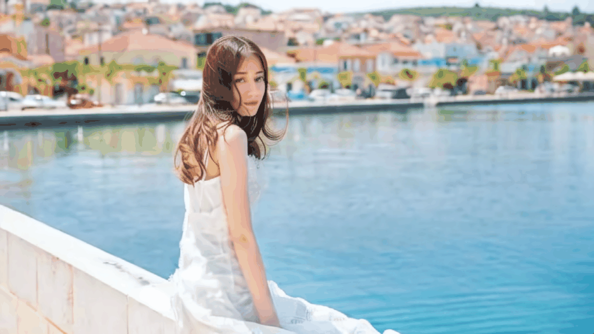</td>
</tr></table>

Settings:

- Image process: Center Crop To 576x1024
- MotionType: Provided Complex Camera Poses
- Camera: Pose_5
- speed : 1.
- FPS: 10
- n_samples: 2
- Seed: 12

## EX.8

Images source: [Link](https://image.baidu.com/search/detail?ct=503316480&z=3&ipn=d&word=%E8%83%A1%E6%AD%8C%20%E7%B9%81%E8%8A%B1&step_word=&hs=0&pn=20&spn=0&di=7264239678495129601&pi=0&rn=1&tn=baiduimagedetail&is=0%2C0&istype=2&ie=utf-8&oe=utf-8&in=&cl=2&lm=-1&st=-1&cs=4036747340%2C2111106894&os=276031997%2C1929250128&simid=4036747340%2C2111106894&adpicid=0&lpn=0&ln=775&fr=&fmq=1705215253654_R&fm=result&ic=&s=undefined&hd=1&latest=0&copyright=0&se=&sme=&tab=0&width=0&height=0&face=undefined&ist=&jit=&cg=&bdtype=0&oriquery=&objurl=https%3A%2F%2Fwx1.sinaimg.cn%2Fcrop.0.6.1920.1067%2F0066ohU2ly1govxpa5dxmj31hc0u0u0z.jpg&fromurl=ippr_z2C%24qAzdH3FAzdH3F4_z%26e3Bojtk5_z%26e3BvgAzdH3F7AzdH3Fc9mddm0dld&gsm=96&rpstart=0&rpnum=0&islist=&querylist=&nojc=undefined&dyTabStr=MCwzLDEsMiw2LDQsNSw3LDgsOQ%3D%3D&lid=5722294393001157268)

<table><tr>
<td></td>
<td></td>
</tr></table>

Settings:

- Image process: Center Crop To 576x1024
- MotionType: Provided Complex Camera Poses
- Camera: Pose_5
- speed : 1.6
- FPS: 10
- n_samples: 2
- Seed: 12

## EX.9

Images source: [Link](https://www.bing.com/images/search?view=detailV2&ccid=H1AS0UGD&id=EC6B5EF84D25469B5791D90F9431E9EBEC3D6D8E&thid=OIP.H1AS0UGDMa2NzuYDYGd3QwHaE8&mediaurl=https%3a%2f%2fth.bing.com%2fth%2fid%2fR.1f5012d1418331ad8dcee60360677743%3frik%3djm097OvpMZQP2Q%26riu%3dhttp%253a%252f%252fsports.dzwww.com%252frdjj%252f201301%252fW020130118293883324479.jpg%26ehk%3djZhJjcYvUT7tkZ4uhJb439W4RL%252fIMkoMpPJKoRd3gY8%253d%26risl%3d%2)

<table><tr>
<td>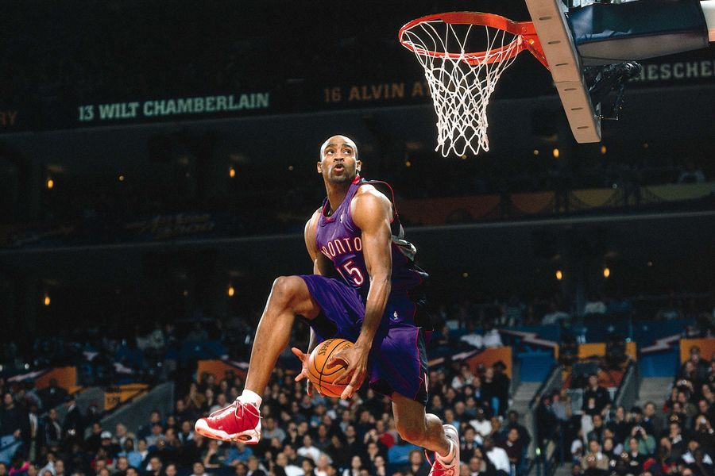</td>
<td></td>
</tr></table>

Settings:

- Image process: Center Crop To 576x1024
- MotionType: Provided Complex Camera Poses
- Camera: Pose_7
- speed : 1.6
- FPS: 15
- n_samples: 2
- Seed: 123

## EX.10

Images source: [Link](https://image.baidu.com/search/detail?ct=503316480&z=3&ipn=d&word=%E6%A2%85%E8%A5%BF%E5%8D%95%E4%BA%BA%E5%B0%84%E9%97%A8%E9%AB%98%E6%B8%85%E6%A8%AA%E5%B1%8F&step_word=&hs=0&pn=4&spn=0&di=7264239678495129601&pi=0&rn=1&tn=baiduimagedetail&is=0%2C0&istype=2&ie=utf-8&oe=utf-8&in=&cl=2&lm=-1&st=-1&cs=4126112926%2C151235348&os=2920374078%2C1478858535&simid=4103375780%2C466057095&adpicid=0&lpn=0&ln=1541&fr=&fmq=1705201693354_R&fm=result&ic=&s=undefined&hd=1&latest=0&copyright=0&se=&sme=&tab=0&width=0&height=0&face=undefined&ist=&jit=&cg=&bdtype=0&oriquery=&objurl=https%3A%2F%2Fi2.hdslb.com%2Fbfs%2Farchive%2F7bb6cbc47b537cf21079f9499323fdfc5b771dbc.jpg&fromurl=ippr_z2C%24qAzdH3FAzdH3Fooo_z%26e3Bktstktst_z%26e3Bv54AzdH3Fet1j5AzdH3Fwecbl809mlb&gsm=1e&rpstart=0&rpnum=0&islist=&querylist=&nojc=undefined&dyTabStr=MCwzLDEsMiw2LDQsNSw3LDgsOQ%3D%3D&lid=7368247065479533838)

<table><tr>
<td>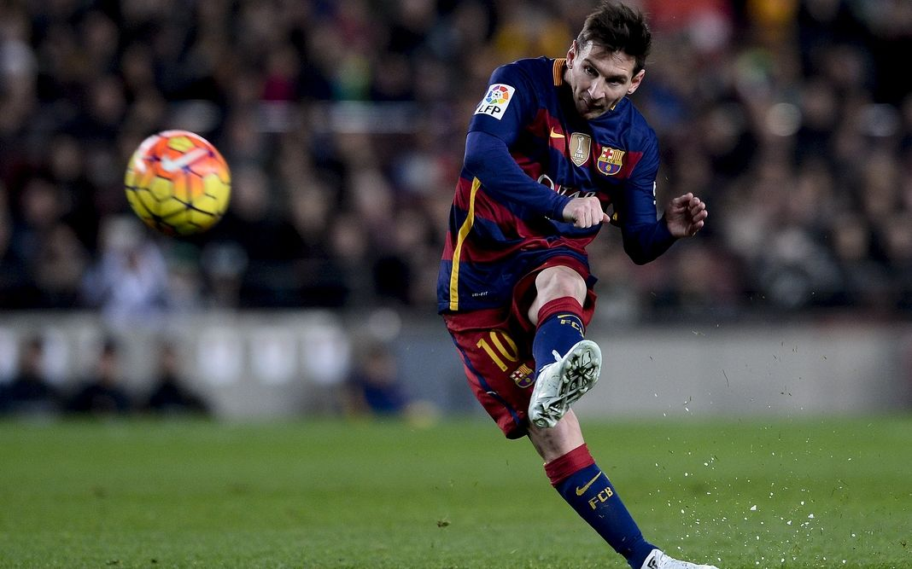</td>
<td>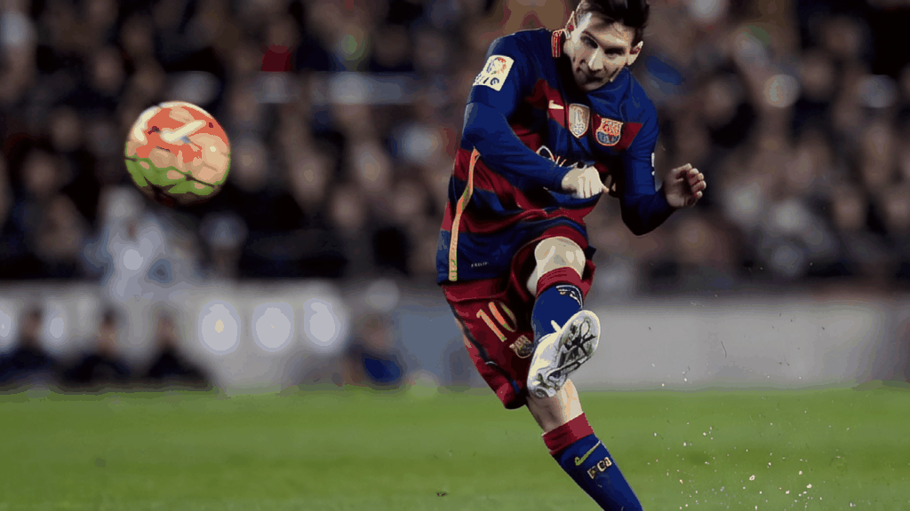</td>
</tr></table>

Settings:

- Image process: Center Crop To 576x1024
- MotionType: Provided Complex Camera Poses
- Camera: Pose_7
- speed : 1.6
- FPS: 6
- n_samples: 2
- Seed: 1231

## EX.11

Images source: [Link](https://www.bing.com/images/search?view=detailV2&ccid=F0H0IbpJ&id=38DC8EF800A0F2B1EE590AA7F4E95F89D5E9F081&thid=OIP.F0H0IbpJ72O23mg4wOofPgHaEC&mediaurl=https%3a%2f%2fth.bing.com%2fth%2fid%2fR.1741f421ba49ef63b6de6838c0ea1f3e%3frik%3dgfDp1Ylf6fSnCg%26riu%3dhttp%253a%252f%252f5b0988e595225.cdn.sohucs.com%252fimages%252f20180929%252f18934dc9a40146619f9dbec6b81f4764.jpeg%26ehk%3d%252ffOgTB5ESFDFu3AKWpSLhPBCykCYc9DcXhT2PCbB%252fPs%253d%26risl%3d%26pid%3dImgRaw%26r%3d0&exph=349&expw=640&q=%e9%b8%a3%e4%ba%ba+%e8%9e%ba%e6%97%8b%e4%b8%b8+%e9%ab%98%e6%b8%85+%e6%a8%aa%e5%b1%8f&simid=608048467864929069&FORM=IRPRST&ck=C38DA7ACC1569B2712914FA4F37ED505&selectedIndex=23&itb=0&ajaxhist=0&ajaxserp=0)

<table><tr>
<td>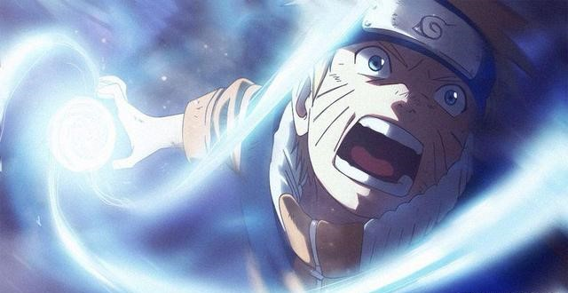</td>
<td>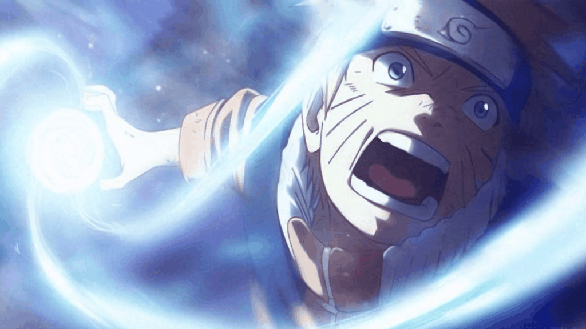</td>
</tr></table>

Settings:

- Image process: Center Crop To 576x1024
- MotionType: Custom Camera Poses -- Customized Mode 2: Both A and B
- Camera: [CW, Zoom Out]
- speed : 1.
- FPS: 10
- n_samples: 2
- Seed: 123

## EX.12

Images source: [Link](https://image.baidu.com/search/detail?ct=503316480&z=3&ipn=d&word=%E9%BE%99%E7%8F%A0%20%E6%82%9F%E7%A9%BA%20%E9%BE%9F%E6%B4%BE%E6%B0%94%E5%8A%9F&step_word=&hs=0&pn=2&spn=0&di=7264239678495129601&pi=0&rn=1&tn=baiduimagedetail&is=0%2C0&istype=2&ie=utf-8&oe=utf-8&in=&cl=2&lm=-1&st=-1&cs=955822693%2C750015962&os=3322719065%2C3420071191&simid=4112067935%2C565568296&adpicid=0&lpn=0&ln=926&fr=&fmq=1705202368270_R&fm=result&ic=&s=undefined&hd=1&latest=0&copyright=0&se=&sme=&tab=0&width=0&height=0&face=undefined&ist=&jit=&cg=&bdtype=0&oriquery=&objurl=https%3A%2F%2Fdingyue.ws.126.net%2FmIxlSXzOp2kKMwWMC4bStnQMN4zHzxZZFuiwM3%3D5FJAjh1546860615701compressflag.jpg&fromurl=ippr_z2C%24qAzdH3FAzdH3Fn2_z%26e3B8mn_z%26e3Bv54AzdH3F35hjAzdH3Fw6ptvsjAzdH3FE9ULLadVac8cG8ED_z%26e3Bip4s&gsm=1e&rpstart=0&rpnum=0&islist=&querylist=&nojc=undefined&dyTabStr=MCwzLDEsMiw2LDQsNSw3LDgsOQ%3D%3D&lid=8162542751524142976)

<table><tr>
<td>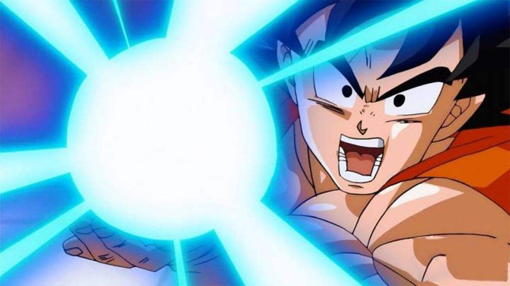</td>
<td></td>
</tr></table>

Settings:

- Image process: Center Crop To 576x1024
- MotionType: Custom Camera Poses -- Customized Mode 2: Both A and B
- Camera: [Pan Left, Zoom In]
- speed : 1.
- FPS: 6
- n_samples: 2
- Seed: 123

## EX.13

Images source: [Midjourney](https://www.midjourney.com/), prompt: "tesla cyberpunk running in the road, night, cyperpunk style, future style. --v 6.0 --aspect 16:9"

<table><tr>
<td>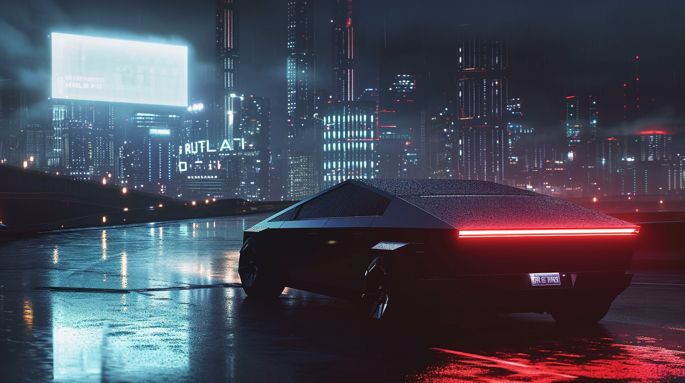</td>
<td>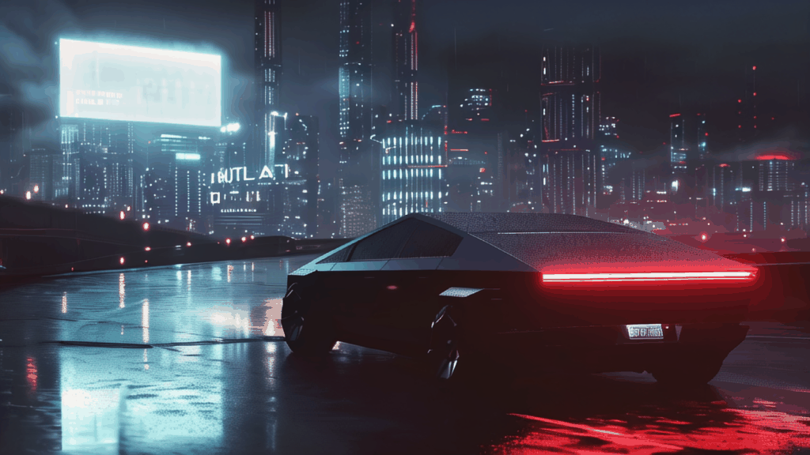</td>
</tr></table>

Settings:

- Image process: Center Crop To 576x1024
- MotionType: Provided Complex Camera Poses
- Camera: Pose_1
- speed : 1.
- FPS: 8
- n_samples: 2
- Seed: 1234

## EX.14

Images source: [Midjourney](https://www.midjourney.com/), prompt: "fighting spacecraft night, cyperpunk style, future style. --v 6.0 --aspect 16:9"

<table><tr>
<td>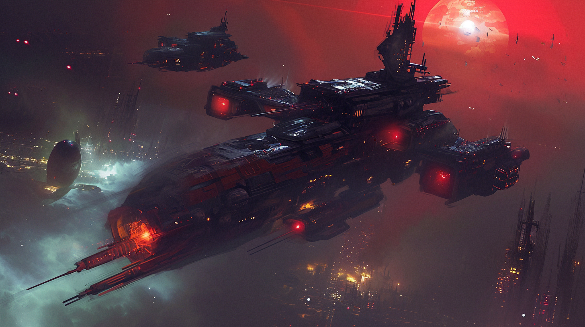</td>
<td>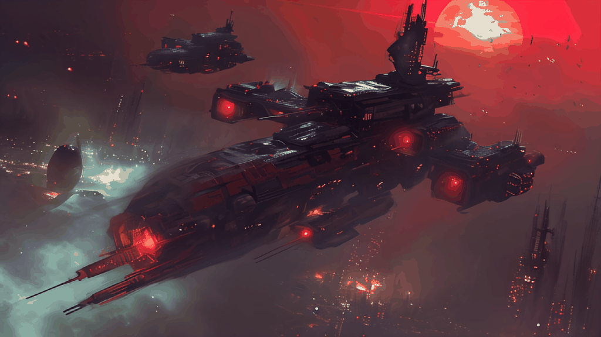</td>
</tr></table>

Settings:

- Image process: Center Crop To 576x1024
- MotionType: Provided Complex Camera Poses
- Camera: Pose_8
- speed : 3.
- FPS: 6
- n_samples: 2
- Seed: 1234
