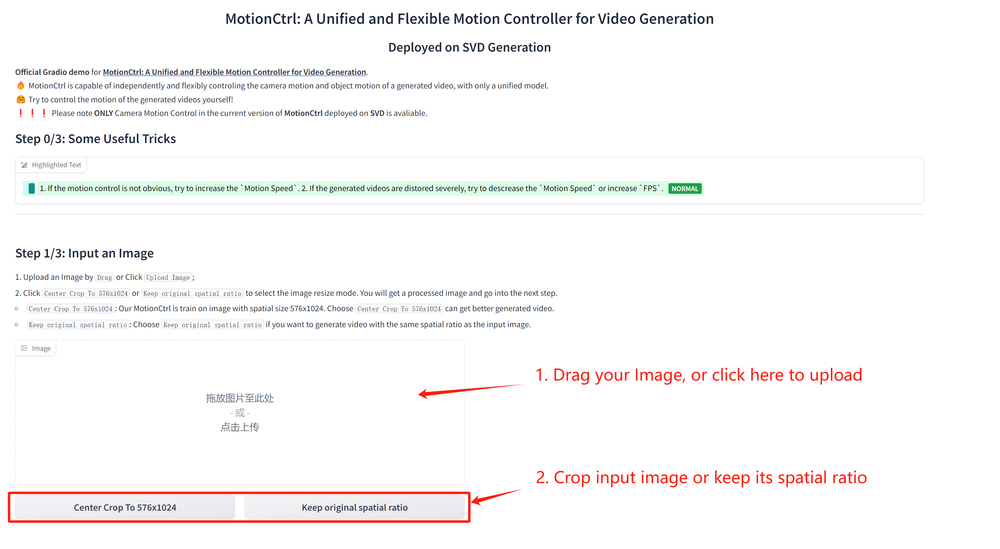
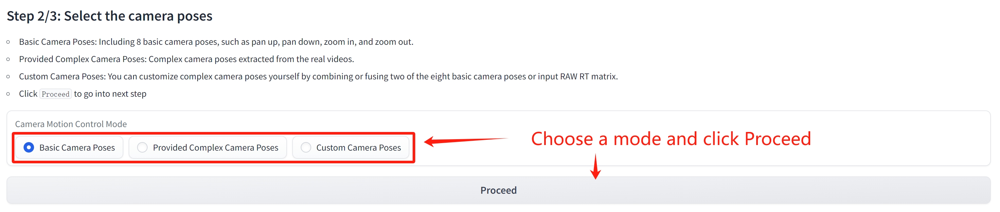
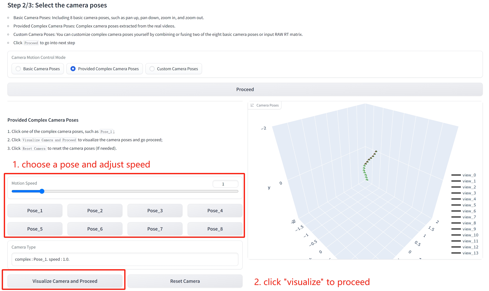
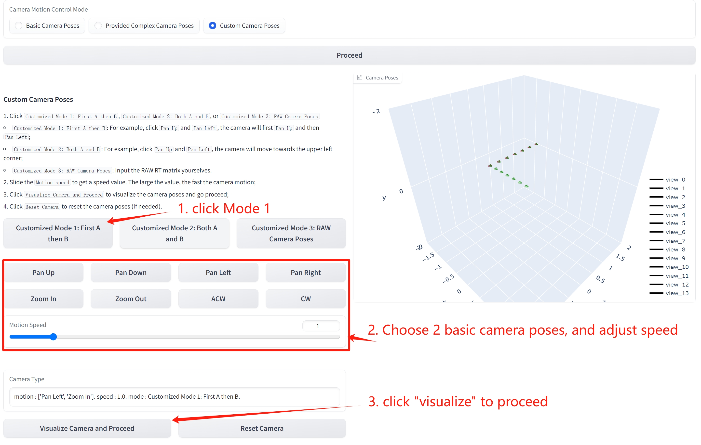
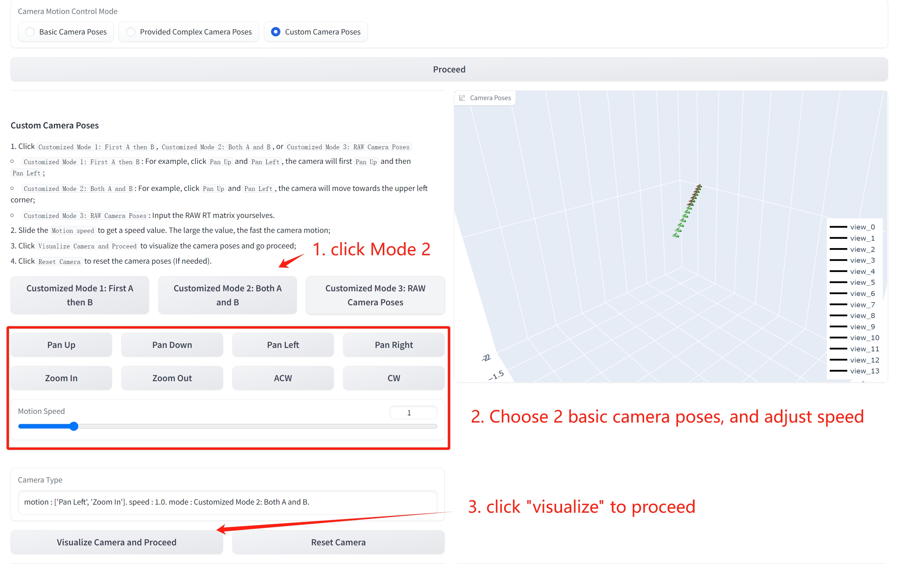
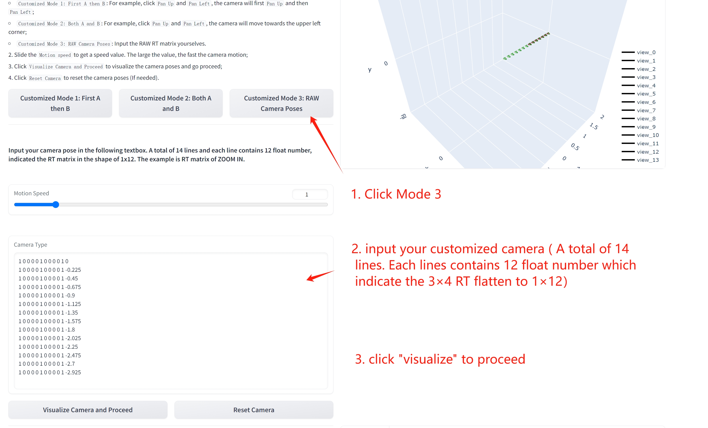
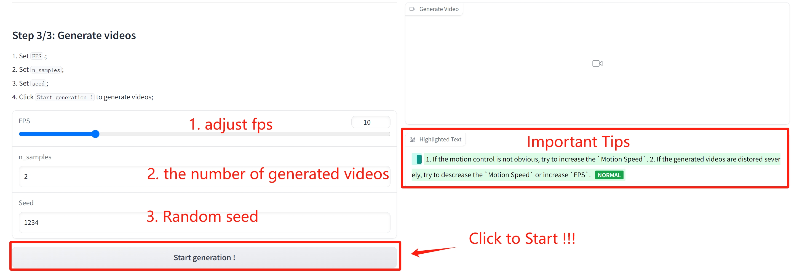
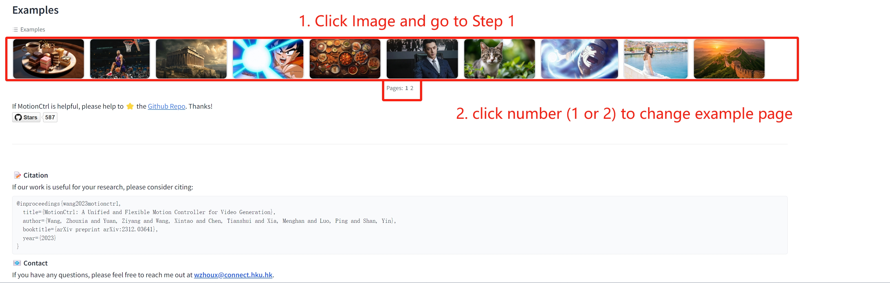

# Tutorial of MotionCtrl_SVD Demo

Here is a tutorial of how to use MotionCtrl_SVD Demo step by step.

- [Important Tips](#tips)
- [Step 1. Pick up your image ](#step-1-pick-up-your-image)
- [Step 2. Customize your camera motion](#step-2-customize-your-camera-motion)
- [Step 3. Generate videos](#step-3-generate-videos)
- [Examples](#demo-examples)

 

---

## Tips
If the motion control is not obvious, try to increase the `Motion Speed`. 2. If the generated videos are distored severely, try to descrease the `Motion Speed` or increase `FPS`

 

---

## Step 1. Pick up your image 

<!--  -->

## Step 2. Customize your camera motion
We provide three levels of complexity for camera motion: 
- Basic Camera Poses
- Provided Complex Camera Poses
- Custom Camera Poses

---

### 2.1 Basic Camera Poses
We provide 8 basic camera poses for you to choose from. You can pick up anyone and adjust the speed as your wish.

---

### 2.2 Provided Complex Camera Poses
We provide 8 complex camera poses for you to choose from. You can pick up anyone and adjust the speed as your wish.

---

### 2.3 Custom Camera Poses
We provide 3 sub mode in this mode.
- Customized Mode 1: First A then B
- Customized Mode 2: Both A and B
- Customized Mode 3: RAW Camera Poses

#### 2.3.1 Customized Mode 1: First A then B
- Based on 8 Basic Camera Poses, you can pick up basic pose A and basic pose  B. Then you can get a camera motion that firstly goes as pose A, and then goes as pose B. 

- For example, if you choose `Pan Left` as pose A, and `Zoom In` as pose B, you will firstly see the camera pan left, and then see the camera zoom in.

#### 2.3.2 Customized Mode 2: Both A and B
- Based on 8 Basic Camera Poses, you can pick up basic pose A and basic pose  B. Then you can get a camera motion that goes as pose A and pose B semantangously.

- For example, if you choose `Pan Left` as pose A, and `Zoom In` as pose B, you willsee the camera goes as the combination of pan left and zoom in (similar to vector addition). 

#### 2.3.3 Customized Mode 3: RAW Camera Poses
- This is the real camera input for model. 

## Step 3. Generate videos
adjust `fps`, `num`, `seed`, and click `Start generation` to generate videos.

## Demo Examples

We provide some example with camera settings, you can go to [showcase_svd](./showcase_svd.md) for details.

